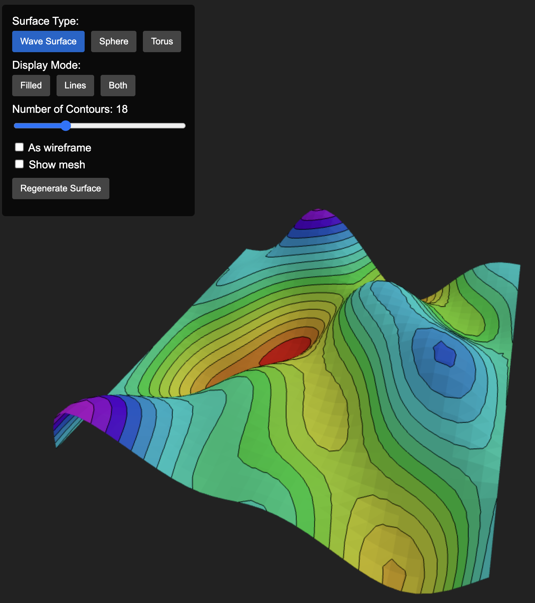

# Three.js with iso-contours on 3D triangulated surfaces

Written in TypeScript.

<p align="center">
    
</p>

## Building the lib
```bash
git clone https://github.com/xaliphostes/keplerlit.git
npm install
npm run build
```

## Testing

Run
```bash
npm run serve
```

and then open [this link](http://127.0.0.1:8080).

## Live server
[**Try this link**](https://xaliphostes.github.io/keplerlit/)