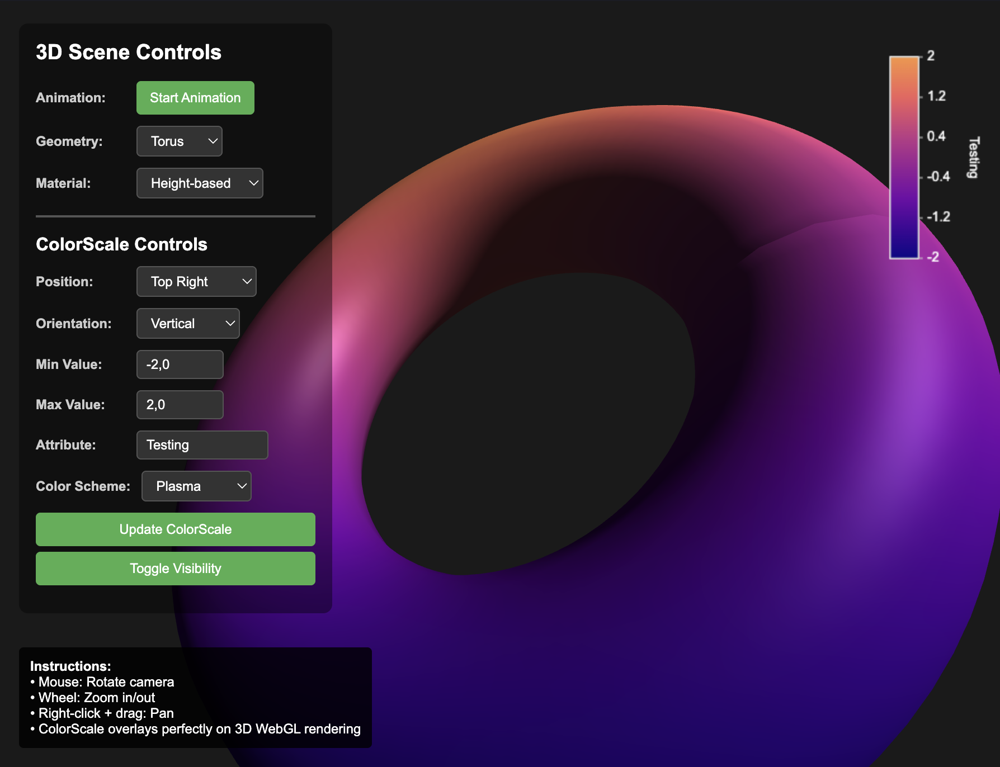

# TypeScript ColorScale

A TypeScript-based 2D ColorScale overlay component that can be rendered on top of any Canvas (2D or WebGL/3D) rendering without interfering with the underlying graphics.

<center>
    
</center>

## Features

- **Overlay Architecture**: Non-destructive overlay that sits on top of existing canvas content
- **Flexible Positioning**: User-defined x, y coordinates and dimensions
- **Custom Color Scales**: Define color stops with positions and colors
- **Dual Orientation**: Support for vertical and horizontal orientations
- **Value Display**: Shows min/max values and attribute names
- **Real-time Updates**: Dynamic updating of all properties
- **WebGL Compatible**: Works with WebGL/OpenGL 3D rendering
- **TypeScript**: Full type safety and IntelliSense support

## Usage

### Basic Implementation

```typescript
import { ColorScale, ColorStop } from './ColorScale.js';

// Define color stops
const colorStops: ColorStop[] = [
  { position: 0, color: '#0066cc' },
  { position: 0.5, color: '#ffff00' },
  { position: 1, color: '#cc0000' }
];

// Create color scale overlay
const colorScale = new ColorScale({
  canvas: myCanvas,              // Your existing canvas
  x: 50,                        // X position
  y: 50,                        // Y position  
  width: 30,                    // Width in pixels
  height: 200,                  // Height in pixels
  min: 0,                       // Minimum value
  max: 100,                     // Maximum value
  attributeName: 'Temperature', // Label for the scale
  orientation: 'vertical',      // 'vertical' or 'horizontal'
  colorStops: colorStops
});
```

### WebGL/3D Integration

```typescript
// Works seamlessly on top of WebGL rendering
const webglCanvas = document.getElementById('webgl-canvas') as HTMLCanvasElement;

// Your WebGL rendering loop
function renderLoop() {
  // ... your 3D rendering code ...
  
  // Color scale overlay renders automatically on top
  colorScale.redraw(); // Optional: force redraw
  
  requestAnimationFrame(renderLoop);
}
```

### Dynamic Updates

```typescript
// Update any property dynamically
colorScale.updateRange(-50, 150);
colorScale.updatePosition(100, 100);
colorScale.updateOrientation('horizontal');
colorScale.updateAttributeName('Pressure (Pa)');

// Get color for specific value
const color = colorScale.getColorAtValue(75);

// Show/hide
colorScale.hide();
colorScale.show();
colorScale.toggle();
```

## API Reference

### ColorScaleOptions

| Property | Type | Default | Description |
|----------|------|---------|-------------|
| `canvas` | `HTMLCanvasElement` | - | Target canvas element |
| `x` | `number` | - | X position in pixels |
| `y` | `number` | - | Y position in pixels |
| `width` | `number` | - | Width in pixels |
| `height` | `number` | - | Height in pixels |
| `min` | `number` | - | Minimum data value |
| `max` | `number` | - | Maximum data value |
| `attributeName` | `string` | - | Display name for the attribute |
| `orientation` | `'vertical' \| 'horizontal'` | - | Scale orientation |
| `colorStops` | `ColorStop[]` | - | Array of color stops |
| `fontSize` | `number` | `14` | Font size for labels |
| `fontFamily` | `string` | `'Arial, sans-serif'` | Font family |
| `textColor` | `string` | `'#ffffff'` | Text color |
| `backgroundColor` | `string` | `'rgba(0, 0, 0, 0.7)'` | Background color |
| `borderColor` | `string` | `'#ffffff'` | Border color |
| `borderWidth` | `number` | `2` | Border width |
| `labelOffset` | `number` | `15` | Label offset distance |
| `precision` | `number` | `2` | Decimal precision for values |

### Methods

| Method | Description |
|--------|-------------|
| `updatePosition(x, y)` | Update position |
| `updateSize(width, height)` | Update dimensions |
| `updateRange(min, max)` | Update value range |
| `updateColorStops(stops)` | Update color mapping |
| `updateOrientation(orientation)` | Change orientation |
| `updateAttributeName(name)` | Update display name |
| `getColorAtValue(value)` | Get color for specific value |
| `show()` / `hide()` / `toggle()` | Visibility controls |
| `redraw()` | Force redraw |
| `destroy()` | Cleanup and remove |

## Browser Compatibility

- Modern browsers with Canvas 2D support
- WebGL-enabled browsers for 3D integration
- ES2020+ JavaScript support

## License

MIT License - see LICENSE file for details

# Contact
fmaerten@gmail.com
