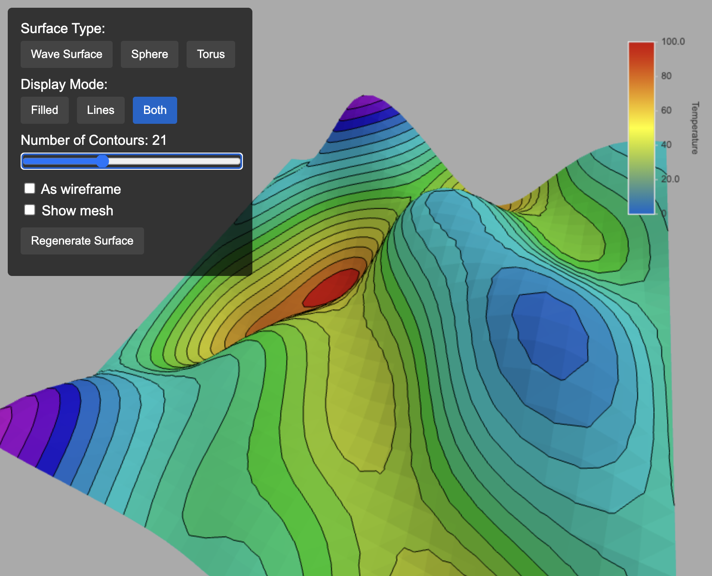

# Three.js with iso-contours on 3D triangulated surfaces

Written in TypeScript.

<p align="center">
    
</p>

# Usage
```js
// three.js part
const scene = ...
const threeGeom = ...
const scalarField = [...] // at vertices
const isoContourList = [...]

// keplerlit part
const result = keplerlit.createIsoContoursFilled(
    convertToKeplerGeometry(threeGeom),
    scalarField,
    isoList: isoList,
    {
        colorTable: 'Rainbow',
        nbColors: 128
    }
)
scene.add(createMeshFromKeplerResult(result))


// ----------------------------------------------
// Utilities for three <-> keplerlit
// ----------------------------------------------

/**
 * Convert Three.js BufferGeometry to KeplerLit BufferGeometry.
 * Since this lib is independent of three.js, we have to convert the geometry and topology accordingly
 */
function convertToKeplerGeometry(threeGeometry) {
    const positions = threeGeometry.attributes.position.array
    const indices = threeGeometry.index ? threeGeometry.index.array : this.generateIndices(positions.length / 3)

    const keplerPositions = new keplerlit.Float32BufferAttribute(Array.from(positions), 3)
    const keplerIndices = new keplerlit.Uint32BufferAttribute(Array.from(indices), 1)

    const keplerGeometry = new keplerlit.BufferGeometry()
    keplerGeometry.setPositions(keplerPositions)
    keplerGeometry.setIndices(keplerIndices)

    return keplerGeometry
}

/**
 * Convert a result from keplerlit to three.js in order to visualize 
 * (have to do that for filled iso-contours only)
 * 
 * ```js
 * const filledContours = new keplerlit.IsoContoursFilled('Rainbow', 256, isoList)
 * const result = filledContours.run(scalarField, keplerGeometry)
 * createMeshFromKeplerResult(result)
 * ```
 */
createMeshFromKeplerResult(result) {
    const geometry = new THREE.BufferGeometry()

    geometry.setAttribute('position', new THREE.Float32BufferAttribute(result.position, 3))
    geometry.setIndex(new THREE.Uint32BufferAttribute(result.index, 1))

    const colors = new Float32Array(result.color)
    geometry.setAttribute('color', new THREE.Float32BufferAttribute(colors, 3))

    const material = new THREE.MeshPhongMaterial({
        vertexColors: true,
        side: THREE.DoubleSide,
        wireframe: this.showWireframeIso,
        flatShading: false,
        polygonOffset: true,
        polygonOffsetFactor: .5
    })

    return new THREE.Mesh(geometry, material)
}
```
